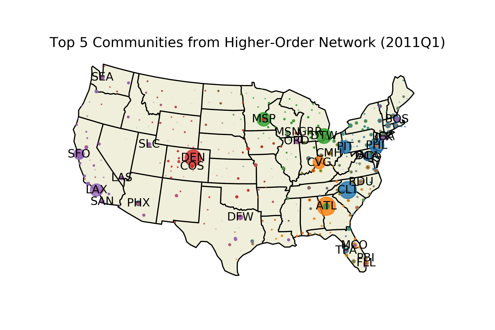
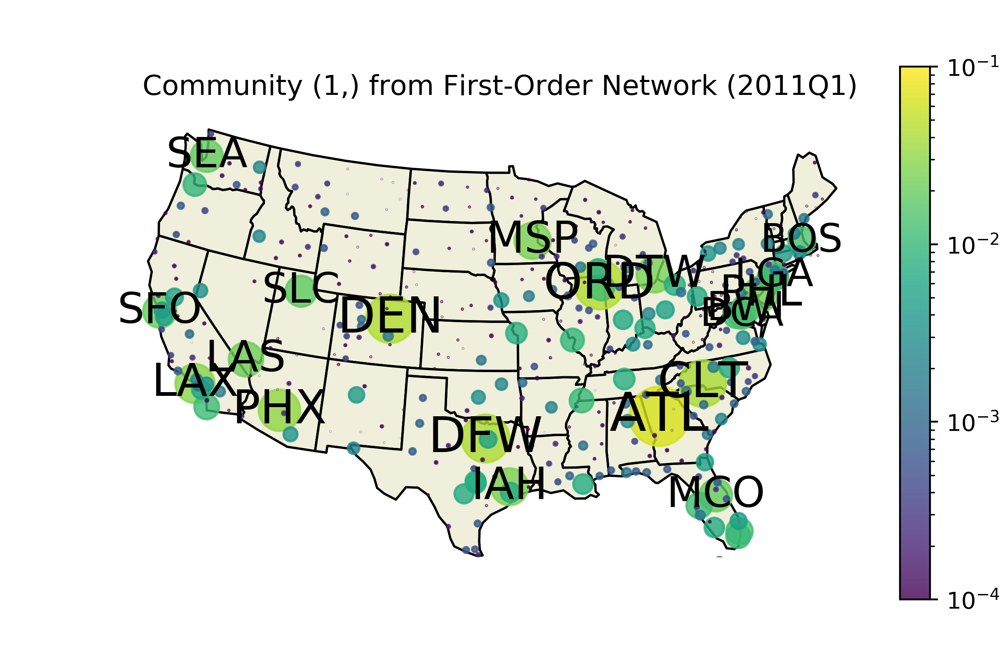
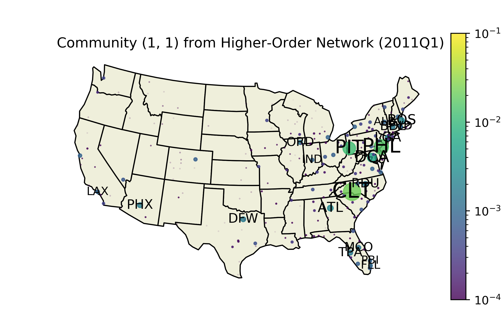
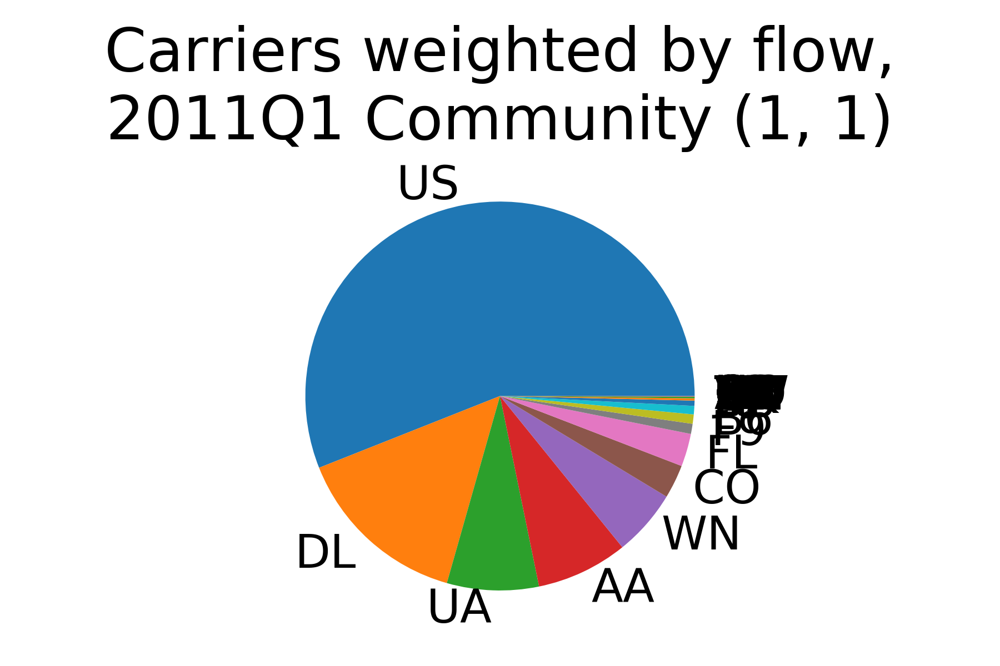

# Sample Data, 2011 Q1

This directory contains sample data from the _signac_ job `6ae284602fc56465315a18f804b30bcb`, corresponding to the statepoint `{"year": 2011, "quarter": 1}`.

## Plots

### InfoMap Communities
The plot below shows the top five communities found in the **higher-order network**, overlaid in different colors. Node colors indicate communities. Sizes correspond to InfoMap flow. Labels indicate three letter IATA airport codes.

By contrast, only one large community is found in the **first-order network**, shown below. Two other tiny communities are found in Alaska (not pictured). Node colors and sizes correspond to InfoMap flow. Labels indicate three letter IATA airport codes.

Below is the top **higher-order network** community from 2011 Q1, which is primarily composed of PIT, PHL, CLT. Node colors and sizes correspond to InfoMap flow. Labels indicate three letter IATA airport codes.

The dominant carriers in community (1, 1) are shown below. This clearly shows that PIT, PHL, CLT in the above plot were hub cities for US Airways in 2011 Q1.

### Excluded files

For file size considerations, raw data and some processed intermediates could not be included. The files missing from this sample data set are:

- `Coupon.zip`, data downloaded from the Bureau of Transportation Statistics
- `Coupon.csv`, raw data extracted from zip file
- `hon_itineraries.txt/part-*`, extracted itineraries
- `all_hon_itineraries.txt`, combined itineraries
- `hon_community_plots/hon_community_*`, community and carrier plots for communities after the top 9
